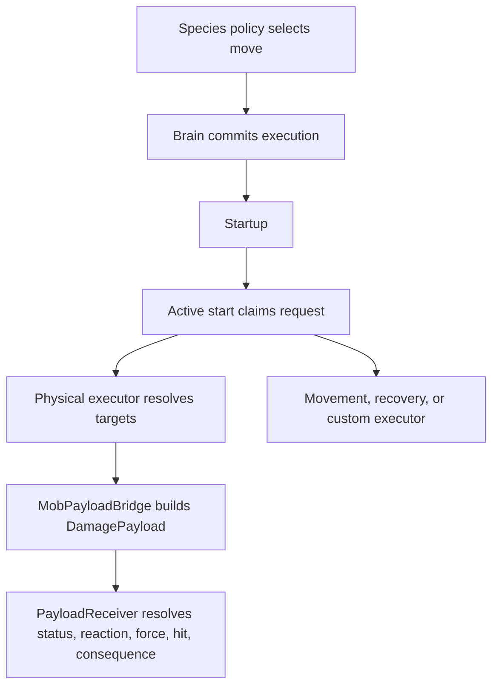

# Animal Body, Locomotion, and Move Effects v1

This contract extends the Mob Engine from behavioral choice into reusable physical capability and gameplay consequence. It is intentionally species-agnostic: a bird, fish, mole, spider, mythic beast, or familiar should be assembled from the same data grammar.

## Body and locomotion contract

A species continues to author simple `body_tags` and `locomotion_tags`. `MobLocomotionCatalog` normalizes the locomotion tags, checks the anatomy, resolves dependencies, and returns a profile containing supported modes, modifiers, transitions, media, definitions, and validation failures.

| Capability | Kind | Space | Typical anatomy | Purpose |
| --- | --- | --- | --- | --- |
| `ground` | mode | planar | legs or a slithering body | Walking and terrestrial navigation |
| `swimmer` | mode | volumetric | swimmer, fins, flippers, or tentacles | Surface and submerged movement |
| `flight` | mode | volumetric | wings or levitation | Free movement through air |
| `climber` | mode | surface | claws, hands, pads, tentacles, or climbing limbs | Walls, ceilings, trees, and ledges |
| `burrower` | mode | volumetric | digging limbs, claws, boring head, or burrowing body | Soil, sand, and snow traversal |
| `runner` | modifier | planar | legs plus `ground` | Faster ground gait |
| `serpentine` | modifier | planar | tail or slithering body plus `ground` | Tight-turning slither gait |
| `hover` | modifier | volumetric | flight anatomy plus `flight` | Low-speed aerial control |
| `jumper` | transition | volumetric | legs plus `ground` | Short airborne transitions |

Aliases such as `swimming`, `surface_swim`, `fly`, `climb`, and `burrow` normalize to canonical capabilities. An authored species must resolve at least one valid mode. Invalid combinations such as flight without wings or levitation fail catalog validation.

The catalog describes capability, not navigation implementation. Ground navigation, water steering, aerial steering, surface adhesion, and subterranean traversal remain physical executors that consume the same resolved profile.

Moves may require locomotion capabilities independently from anatomy. Pounce requires `jumper`, while Wade requires `swimmer`. This prevents anatomy-only mistakes such as granting aerial moves to a winged animal that cannot fly or tunneling moves to every creature with claws. Species catalog validation checks every moveset against both contracts.

## Move effect contract

Every committed move owns one execution state with startup, active, and recovery. The first supported trigger is `active_start`. Crossing that boundary claims exactly one effect request, even when a coarse frame advances across the entire active window.

`MobMoveEffectRequest` normalizes:

- Request identity from species, actor, execution serial, and move
- Effect kind and delivery class
- Target mode, range, and radius
- Full authored effect data
- Shared payload data for damage, area damage, projectile, status, and buff effects
- Source and move lineage tags

Delivery classes separate decision timing from physical execution:

- `contact_payload`: deliver after a contact or hit-volume confirmation
- `area_payload`: the executor gathers unique in-range targets, then delivers once to each
- `projectile_payload`: cannot deliver until a projectile confirms impact
- `recovery`: routed to the actor's health, stamina, or drive recovery executor
- `executor`: movement, habitat seeking, waiting, and presentation-owned behavior
- `custom`: an extension seam for new effects without changing the brain

`MobPayloadBridge` converts payload-capable requests to the existing `DamagePayload` contract. It preserves health damage, stance damage, element, hit type, force, statuses, critical identity, move tags, and species lineage. It sends through `PayloadReceiver`, `receive_damage_payload`, or `HitReceiver`, keeping elemental reactions and world consequences in the established receiver pipeline. Projectile requests explicitly require `impact_confirmed`.

## Authoring examples

A flying bird can author:

- `body_tags: ["legs", "wings", "beak", "voice"]`
- `locomotion_tags: ["ground", "flight"]`
- Shared moves requiring mouth, voice, or flight-compatible executor behavior

A fish can author:

- `body_tags: ["fins", "gills", "mouth", "tail"]`
- `locomotion_tags: ["swimmer"]`
- Bite, flee, school call, or custom water-current moves

A mole can author:

- `body_tags: ["legs", "claws", "digging_limbs", "mouth"]`
- `locomotion_tags: ["ground", "burrower"]`
- Graze, bite, flee, tunnel, or surface-transition policies

No new brain class is required for any of these. New locomotion physics plugs into the catalogued mode; new moves plug into the shared move/effect contract.

## Invariants

- Species policy chooses a move; executors do not re-roll behavior.
- Anatomy, locomotion profiles, and move locomotion requirements are validated before runtime.
- One execution claims an `active_start` effect at most once.
- Interruption before the active phase produces no effect request.
- Contact, area, and projectile delivery require physical target confirmation.
- Projectile payloads never teleport directly to a target.
- Existing payload receivers own reactions and consequences.
- Unknown locomotion tags fail loudly; unknown effect kinds route through the custom executor seam.
