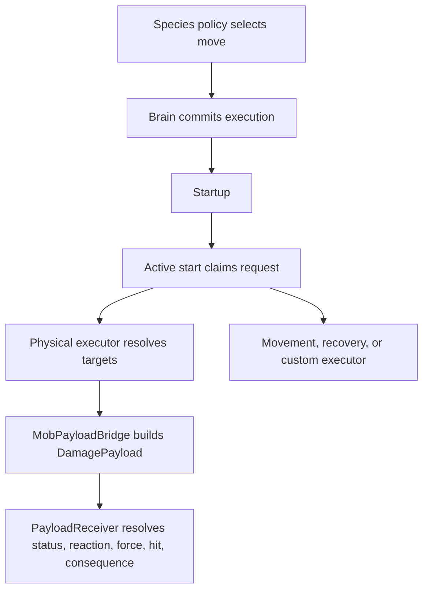

# Animal Body, Locomotion, and Move Effects v1

This contract extends the Mob Engine from behavioral choice into reusable physical capability and gameplay consequence. It is intentionally species-agnostic: a bird, fish, mole, spider, mythic beast, or familiar should be assembled from the same data grammar.

## Body and locomotion contract

A species continues to author simple `body_tags` and `locomotion_tags`. `MobLocomotionCatalog` normalizes the locomotion tags, checks the anatomy, resolves dependencies, and returns a profile containing supported modes, modifiers, transitions, media, definitions, and validation failures.

| Capability | Kind | Space | Typical anatomy | Purpose |
| --- | --- | --- | --- | --- |
| `ground` | mode | planar | legs or a slithering body | Walking and terrestrial navigation |
| `swimmer` | mode | volumetric | swimmer, fins, flippers, or tentacles | Surface and submerged movement |
| `flight` | mode | volumetric | wings or levitation | Free movement through air |
| `climber` | mode | surface | claws, hands, pads, tentacles, or climbing limbs | Walls, ceilings, trees, and ledges |
| `burrower` | mode | volumetric | digging limbs, claws, boring head, or burrowing body | Soil, sand, and snow traversal |
| `runner` | modifier | planar | legs plus `ground` | Faster ground gait |
| `serpentine` | modifier | planar | tail or slithering body plus `ground` | Tight-turning slither gait |
| `hover` | modifier | volumetric | flight anatomy plus `flight` | Low-speed aerial control |
| `jumper` | transition | volumetric | legs plus `ground` | Short airborne transitions |

Aliases such as `swimming`, `surface_swim`, `fly`, `climb`, and `burrow` normalize to canonical capabilities. An authored species must resolve at least one valid mode. Invalid combinations such as flight without wings or levitation fail catalog validation.

The catalog describes capability. `MobLocomotionExecutor` now consumes the resolved profile at runtime. It owns active mode, catalog-legal transitions, environmental medium validation, planar/surface/volumetric direction projection, acceleration and gravity policy, standard water-current sampling, surface buoyancy, explicit gait modifiers, reset, and debug state. It composes under `GenericAnimalActor` as `SwimmingController`, so the established `SwimmingWaterVolume` automatically recognizes compatible animals without creating a water-specific brain.

Modifiers such as Runner and Hover are supported capabilities, not permanent bonuses. A move or authored state must activate them explicitly, and a mode transition retires modifiers whose dependencies no longer hold. This preserves existing ground movement while leaving gait changes data-driven.

The runtime is a physical steering contract, not a pathfinder or habitat author. Flight accepts true three-dimensional intent; swimming combines three-dimensional intent with water current and surface support; ground stays planar and gravity-driven. Surface normals for climbing, navigable air/water volumes, and subterranean route topology remain authored environment inputs to the same executor.

Moves may require locomotion capabilities independently from anatomy. Pounce requires `jumper`, while Wade requires `swimmer`. This prevents anatomy-only mistakes such as granting aerial moves to a winged animal that cannot fly or tunneling moves to every creature with claws. Species catalog validation checks every moveset against both contracts. The active runtime mode also enters decision context as `locomotion_mode:<id>`, allowing a Pokémon-like policy to require that a capable creature is currently swimming, flying, climbing, or burrowing.

## Move effect contract

Every committed move owns one execution state with startup, active, and recovery. The first supported trigger is `active_start`. Crossing that boundary claims exactly one effect request, even when a coarse frame advances across the entire active window.

`MobMoveEffectRequest` normalizes:

- Request identity from species, actor, execution serial, and move
- Effect kind and delivery class
- Target mode, range, and radius
- Full authored effect data
- Shared payload data for damage, area damage, projectile, status, and buff effects
- Source and move lineage tags

Delivery classes separate decision timing from physical execution:

- `contact_payload`: resolve the nearest eligible target within authored reach at active start; specialized actors may supply animation hit-volume results explicitly
- `area_payload`: gather unique targets inside the authored radius, then deliver once to each
- `projectile_payload`: spawn the existing physical `GenericProjectile`; payload delivery remains owned by collision impact
- `recovery`: route health and stamina recovery through a compatible receiver
- `executor`: expose movement, habitat seeking, waiting, and presentation-owned behavior without inventing another action decision
- `custom`: expose an extension seam for new effects without changing the brain

`MobEffectTargetResolver` accepts an actor-owned target provider, explicit targets, or generic group fallbacks. Actor providers are authoritative even when they return no targets, preventing a missing packmate from silently becoming a different-species ally. The resolver removes duplicates and source descendants, enforces range or radius, optionally checks line of sight, sorts by distance, and accepts an optional relation/faction filter.

`MobMoveEffectExecutor` binds directly to `MobBrainComponent.move_effect_requested`. It remembers request IDs to prevent double application, handles contact and area delivery, spawns the existing `GenericProjectile` for projectile effects, routes recovery through `MobRecoveryBridge`, and exposes movement or custom effects to a specialized executor signal. Reset clears request memory and diagnostic counts and retires any owned projectiles still in flight.

`MobPayloadBridge` converts payload-capable requests to the existing `DamagePayload` contract. It preserves health damage, stance damage, element, hit type, force, statuses, critical identity, move tags, and species lineage. It sends through `PayloadReceiver`, `receive_damage_payload`, or `HitReceiver`, keeping elemental reactions and world consequences in the established receiver pipeline. Projectile requests explicitly require `impact_confirmed`.

## Vitals and recovery contract

`MobVitalsComponent` gives any species a reusable health, stamina, recovery, and incapacitation state. Maximum health is derived from `MobSpeciesDefinition.base_stats`; callers may override health or stamina without changing the component. It accepts the shared `DamagePayload` grammar, accepts recovery effect dictionaries, reports exact applied amounts, supports stamina spending, and can revive an incapacitated actor when health rises above zero.

The existing canonical combat `StatusReceiver` is composed into animals rather than duplicated. A backward-compatible extension bounds its active status count, exposes deterministic status advancement and policy-ready self tags, and lets damage-over-time payloads fall back to any parent actor implementing `receive_damage_payload`. Primary payload statuses such as Wet and Pack Focus are retained by the actor; additional augment riders such as Poison use the same receiver seam. Existing control semantics also apply: Stun, Freeze, and Stagger block animal decisions, while Root, Chill, and Leaf Pelt feed the canonical movement multiplier.

`GenericAnimalActor` composes the vitals, condition, and effect-executor components. Its decision context now uses real health ratio, injury tags, and active condition tags; hostile payloads interrupt the current action and raise a survival response; zero health stops decisions and horizontal action; Graze reaches the shared recovery receiver; and a lab reset restores vitals, conditions, and exactly-once execution state.

## Authoring examples

A flying bird can author:

- `body_tags: ["legs", "wings", "beak", "voice"]`
- `locomotion_tags: ["ground", "flight"]`
- Shared moves requiring mouth, voice, or flight-compatible executor behavior

A fish can author:

- `body_tags: ["fins", "gills", "mouth", "tail"]`
- `locomotion_tags: ["swimmer"]`
- Bite, flee, school call, or custom water-current moves

A mole can author:

- `body_tags: ["legs", "claws", "digging_limbs", "mouth"]`
- `locomotion_tags: ["ground", "burrower"]`
- Graze, bite, flee, tunnel, or surface-transition policies

No new brain class is required for any of these. New locomotion physics plugs into the catalogued mode; new moves plug into the shared move/effect contract.

## Invariants

- Species policy chooses a move; executors do not re-roll behavior.
- Anatomy, locomotion profiles, and move locomotion requirements are validated before runtime.
- Runtime mode changes must be supported by the profile, legal from the current mode, and compatible with the supplied environmental medium.
- Supported modifiers are opt-in and cannot survive a mode that violates their dependencies.
- One execution claims an `active_start` effect at most once.
- Interruption before the active phase produces no effect request.
- Contact and area delivery require an eligible in-range target; projectiles require a physical collision impact.
- Actor-owned target providers are authoritative and relation filters remain injectable.
- A request ID cannot apply its consequence twice, including after a failed target lookup.
- Projectile payloads never teleport directly to a target.
- Vitals derive from species data and incapacitation suppresses further action until recovery or reset.
- Timed conditions are bounded, refresh deterministically, and enter move evaluation through self tags.
- Existing payload receivers own reactions and consequences.
- Unknown locomotion tags fail loudly; unknown effect kinds route through the custom executor seam.
